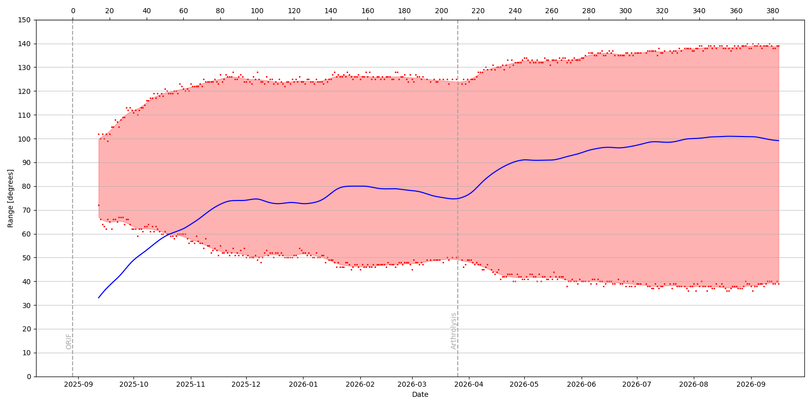

# Elbow measurements

Following a complex fracture of the distal humerus, an open reduction internal fixation procedure (ORIF) was carried out.

Range of Motion (ROM) of the elbow has since been compromised, and daily measurements of ROM have been taken to monitor progress. Measurememts are made with a simple wooden rig and protractor.

The script `elbow.py` generates a plot that shows the ROM across time, as well as the arc (ROM_max - ROM_min).

Note a fully stright arm is 0°, a fully bent arm is ~150°.

